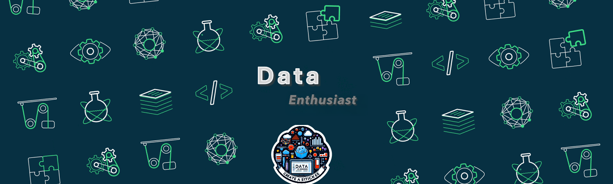

<!-- Add a header GIF -->

<!-- Main heading with introduction -->
<h1 align="center">Hi 👋, I'm Bhanu Teja</h1>
<h3 align="center">I'm a Data Enthusiast from India</h3>

<!-- Add profile views counter -->

 
   

<!-- Add Twitter follow badge -->

 
   

<!-- Contact information -->
- 📫 How to reach me **bhanutejasubbara@gmail.com**

<!-- Connect with me section -->
<h3 align="left">Connect with me:</h3>

<!-- Add a coding GIF aligned to the right -->

<!-- Social links -->

  
  
  

<!-- Languages and tools section -->
<h3 align="left">Languages and Tools:</h3>

 
   
   
   
   
   
   
   
   

<!-- GitHub stats -->

  

  &nbsp;

  

  

